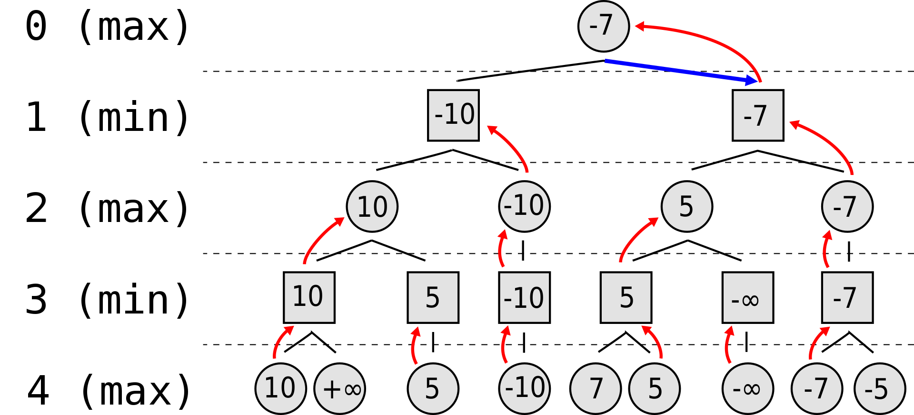

# Report: parallelized MinMax for Nim

- [Report: parallelized MinMax for Nim](#report-parallelized-minmax-for-nim)
- [1. Introduction](#1-introduction)
  - [1.1 Nim](#11-nim)
  - [1.2 Minmax](#12-minmax)
  - [1.3 Project Aim](#13-project-aim)
- [2. Related Work](#2-related-work)
- [3. Proposed Method](#3-proposed-method)
  - [3.1 The iterative form](#31-the-iterative-form)
  - [3.2 C++ Implementation](#32-c-implementation)
  - [3.3 The first CUDA version](#33-the-first-cuda-version)
  - [3.4 Data structure optimization](#34-data-structure-optimization)
- [4. Results and Analysis](#4-results-and-analysis)
- [5. Conclusion](#5-conclusion)

# 1. Introduction

## 1.1 Nim

Nim is a two-player mathematical game of strategy in which players take turns removing objects from distinct heaps or piles of the board. In the classic version of the game, the board typically consists of several piles of objects such as matchsticks, stones, or coins; each pile contains an increasing odd number of sticks. On each turn, a player must remove at least one object, and may remove any number of objects provided they all come from the same heap/pile. The goal of the game is to be the player to take the last object. The game can be played with any number of piles and any number of objects in each pile.

Nim is mostly considered as an impartial game, that can be solved using the Minmax algorithm.

## 1.2 Minmax

Minmax is an algorithm used in game theory to determine the best move in a two-player, zero-sum game. The algorithm works by assuming that the opponent will make the move that is most detrimental to the current player, and then choosing the move that minimizes the worst-case outcome. 
The algorithm recursively evaluates the game tree, assigning a value to each node based on the outcome of the game from that node. The algorithm then selects the move that leads to the board state with the highest minmax value for the current player.

In other words, the first player will always try to maximize his reward, while the second one will always try to minimize it.

## 1.3 Project Aim

The aim of the project is to exploit the power of GPUs to compute the best move by creating a parallel version of the minmax algorithm, developed during the Computational Intelligence course; the original implementation of the algorithm was written in Python, and has been adapted to C++ and CUDA in an iterative form (instead of a recursive).

During the development of the python version of the algorithm, some optimizations were implemented, in order to improve the performance like alpha-beta pruning and maximum tree depth limit.

The alpha-beta pruning consists in cutting off branches in the game tree that cannot possibly affect the final decision and, it can be much more efficient than the standard minimax algorithm. 
Two values are mantained, alpha and beta, which represent the best score that the maximizing player (the player whose turn it is to move) can guarantee and the best score that the minimizing player (the opponent) can guarantee, respectively. 
When the algorithm is inspecting a maximizing node, it updates the alpha value if it finds a value greater than the current alpha, while when it is inspecting a minimizing node, it updates the beta value if it finds a value less than the current beta. If at any point alpha becomes greater than or equal to beta, the algorithm stops searching the current branch and returns the current value of alpha or beta.

Despite the optimizations, the original minmax function is extremely slow, as a matter of fact, it is able to calculate (on a medium performance pc) the best move in a reasonable time for a Nim board with maximum 3 piles.

# 2. Related Work

There are a number of resources available that discuss the implementation of the minimax algorithm on CUDA.

The main approach is to use the GPU to parallelize the search process by evaluating multiple game states simultaneously. This can be done by dividing the game tree into smaller subtrees and assigning each subtree to a different CUDA thread or block.

Another approach is to use CUDA to accelerate the evaluation function, which is used to determine the value of a game state. This can be done by using the GPU to perform complex calculations such as matrix multiplications or neural network evaluations.

Some research papers and open-source projects have been published and show some examples of how to implement the minimax algorithm on CUDA for specific games like chess, Go, Reversi and others.

It's important to note that CUDA is a tool for parallel programming and can be used to speed up many types of computations, but it's not a silver bullet. The implementation of Minimax with or without alpha-beta pruning on CUDA should be evaluated case by case, depending on the game and the hardware used.

In the paper "Parallel Alpha-Beta Algorithm on the GPU", Damjan Strnad and Nikola Guid describe the parallel implementation of the alpha-beta algorithm for the game of Reversi. They compare the speed of the parallel player with the standard serial one using boards of different sizes. 
They show how the GPU implementation of the apha-beta pruning is advantageous for an high computational complexity; as a matter of fact, they achieved a substantial speed-ups for larger boards.

The basis for their implementation is the PV-Split algorithm, in which the parallelism is employed at the nodes on the principal variation (the leftmost path in the heuristically ordered game tree). In their variant the leftmost child of each PV-node is searched on the CPU to establish the lower bound on the PV-node value. The rest of PVnode’s descendants are searched in parallel on the GPU using multiple thread blocks on the GPU.

Here, I am reporting a picture from the paper that well explain the used technique:

PV-Split is also used and described by Christine Johnson, Lee Barford, Sergiu M, Dascalu, and Frederick C. Harris, Jr in their paper "CUDA Implementation of Computer Go Game Tree Search". 
They show how this technique is particularly useful for complex games like Go, that have an estimated search space of ≈10^171.

Kamil Rocki and Reiji Suda, in their "Parallel Minimax Tree Searching on GPU" paper states that the main problem that regards the parallelization is the high communication cost between CPU and GPU, and viceversa. 
They adapted the Minmax algorithm to the Reversi game, and in their implementation, they used a completely different technique: the main tree is split into 2 parts: the upper tree of depth "s" processed in a sequential manner and the lower part of depth "p" processed parallelly. The lower part is then sliced into "k" subtrees, so that each of them can be searched separately.

Here, I am reporting a visual representation of the technique, taken from the paper:

The main problem of this implementation is that they executed the sequential part twice, so a proper choice of values "p" and "s" is very important.

# 3. Proposed Method

## 3.1 The iterative form

In its original implementation, the algorithm evaluates the potential moves of both players by creating and evaluating a tree with a depth-first approach. It starts at the current state of the game, and then recursively explores each possible move and its resulting game state.

However, only GPU microarchitechtures after Fermi support recursion and, in general, recursive algorithm are not so efficient on GPUs; so the algorithm was adapted in an iterative form.

The base minmax behaviour does not change, in fact the depth-first approach is preserved, but a new implementation with a stack and a loop was developed.

The stack now hold all the intermediate information that needs to be passed from one level to another, and it comprehends the current board state, alpha, beta, the current player, the depth, the index of the currently explored move, the stackIndex (that refers to the father node entry), the evaluations array, and the intermediate result that contains the evaluation of the current move from the child node.

The iterative version is characterized by an higher complexity if compared to the recursive one, but it allows to apply some optimizations. 
First of all, the intermediate loop on all the available moves for a particular board state is avoided, as now, at each loop step, previously calculated result is assigned and the next move is evaluated by passing the calculation to the next entry, which will refers to another board state. 
Another small optimization is avoiding to calculate the whole array of possible moves at each step, by just calculating the current move.

## 3.2 C++ Implementation

Before parallelizing the minmax algorithm in a CUDA kernel, the Nim library, along with the algorithm itself, was adapted from Python to C++. The Nim class was created, and it contains a pointer to an array in which the board rows are stored: each element is an integer that indicates the number of remaining objects in that specific row. The array, along with all the other data are created by exploiting the malloc function to dynamically allocate memory at runtime. 
This implementation required the creation of several new data classes, along with several dynamic arrays like the evaluation list and the stack.

This lead to some disadvantages like a high complexity and the need to resize the allocated memory if the number of element exceed the current maximum size; however, the algorithm resulted to be slightly faster then the python implementation. 
Moreover, since all the data structures are allocated in the dynamic memory, the free function must be used carefully, both for avoiding memory waste and incorrect memory deallocation that can lead to a segmentation fault. 

## 3.3 The first CUDA version

## 3.4 Data structure optimization

# 4. Results and Analysis

# 5. Conclusion