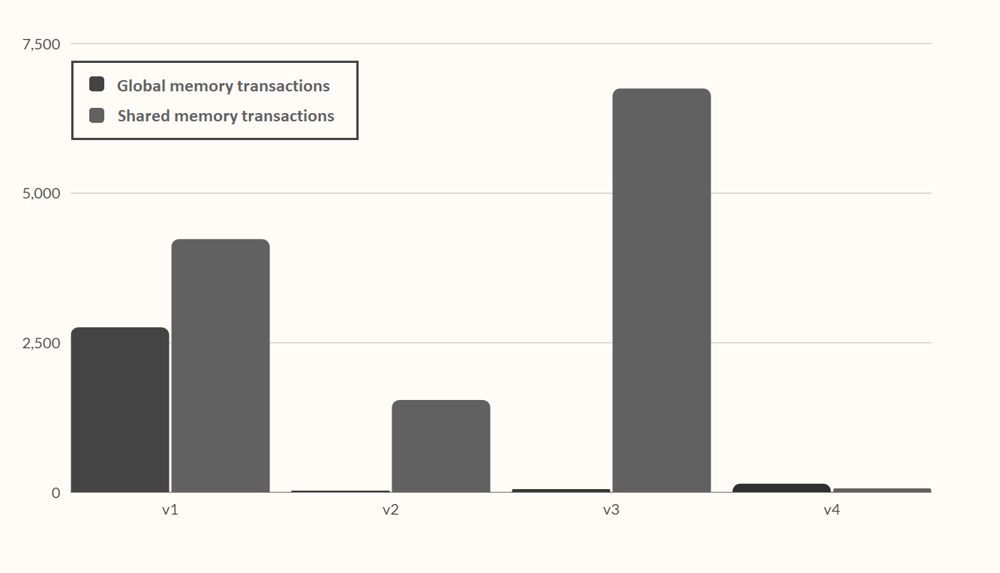

# Report: parallel MinMax on Nim

- [Report: parallel MinMax on Nim](#report-parallel-minmax-on-nim)
- [1. Introduction](#1-introduction)
  - [1.1. Nim](#11-nim)
  - [1.2. Minmax](#12-minmax)
  - [1.3. Project aim and Alpha-Beta pruning](#13-project-aim-and-alpha-beta-pruning)
  - [1.4. Parallel MinMax on CUDA](#14-parallel-minmax-on-cuda)
- [2. Related Work](#2-related-work)
- [3. Proposed Method](#3-proposed-method)
  - [3.1. Iterative form](#31-iterative-form)
  - [3.2. v0: C Implementation](#32-v0-c-implementation)
  - [3.3. v1: First CUDA version](#33-v1-first-cuda-version)
  - [3.4. v2: Data structures optimization](#34-v2-data-structures-optimization)
  - [3.5. v3: More levels in shared memory](#35-v3-more-levels-in-shared-memory)
  - [3.6. v4: Everything in kernel](#36-v4-everything-in-kernel)
- [4. Results and Analysis](#4-results-and-analysis)
- [5. Conclusion and Future Work](#5-conclusion-and-future-work)
- [6. References](#6-references)

# 1. Introduction

## 1.1. Nim

Nim is a two-player mathematical game of strategy in which players take turns removing objects from distinct heaps or piles of the board. In the classic version of the game, the board typically consists of several piles of objects such as matchsticks, stones, or coins; each pile contains an increasing odd number of sticks. On each turn, a player must remove at least one object, and may remove any number of objects provided they all come from the same heap/pile. The goal of the game is to be the player to take the last object. The game can be played with any number of piles and any number of objects in each pile.

Nim is mostly considered as an impartial game, that can be solved using the Minmax algorithm.

## 1.2. Minmax

Minmax is an algorithm used in game theory to determine the best move in a two-player, zero-sum game. The algorithm works by assuming that the opponent will make the move that is most detrimental to the current player, and then choosing the move that minimizes the worst-case outcome. 
The algorithm recursively evaluates the game tree, assigning a value to each node based on the outcome of the game from that node. The algorithm then selects the move that leads to the board state with the highest minmax value for the current player.

In other words, the first player will always try to maximize his reward, while the second one will always try to minimize it.

## 1.3. Project aim and Alpha-Beta pruning

The aim of the project is to exploit the power of GPUs to compute the best move by creating a parallel version of the minmax algorithm, developed during the Computational Intelligence course; the original implementation of the algorithm was written in Python, and has been adapted to C++ and CUDA in an iterative form (instead of a recursive).

During the development of the python version of the algorithm, some optimizations were implemented, in order to improve the performance like alpha-beta pruning and maximum tree depth limit.

The alpha-beta pruning consists in cutting off branches in the game tree that cannot possibly affect the final decision and, it can be much more efficient than the standard minimax algorithm. 
Two values are mantained, alpha and beta, which represent the best score that the maximizing player (the player whose turn it is to move) can guarantee and the best score that the minimizing player (the opponent) can guarantee, respectively. 
When the algorithm is inspecting a maximizing node, it updates the alpha value if it finds a value greater than the current alpha, while when it is inspecting a minimizing node, it updates the beta value if it finds a value less than the current beta. If at any point alpha becomes greater than or equal to beta, the algorithm stops searching the current branch and returns the current value of alpha or beta.

Despite the optimizations, the original minmax function is extremely slow, as a matter of fact, it is able to calculate (on a medium performance pc) the best move in a reasonable time for a Nim board with maximum 3 piles.

## 1.4. Parallel MinMax on CUDA

Using CUDA to accelerate the Minimax algorithm can bring several benefits:

- Performance: CUDA allows the Minimax algorithm to leverage the massive parallel processing power of NVIDIA GPUs, which can significantly speed up the algorithm. This can allow the AI to evaluate more game states in a shorter amount of time, leading to better decision making.
- Scalability: CUDA can handle a large number of concurrent threads, which is crucial for the Minimax algorithm as it needs to evaluate many game states simultaneously.
- Programmability: CUDA provides a simple and flexible programming model that allows developers to easily parallelize the Minimax algorithm and take full advantage of the GPU's capabilities.
- Portability: CUDA code can be easily ported between different platforms and devices, which allows the Minimax algorithm to be run on a wide range of hardware.
- Power efficiency: GPUs are designed to handle large number of simple computations in parallel, which makes them more power efficient than CPUs when it comes to this type of workloads.

Overall, using CUDA to accelerate the Minimax algorithm can lead to a faster and more efficient game-playing AI, which can improve the overall user experience and allows to handle larger and more complex game states.

# 2. Related Work

Minimax was firstly described in the 1950s by John von Neumann and Oskar Morgenstern in their book "Theory of Games and Economic Behavior". The algorithm was originally developed to analyze two-player, zero-sum games such as chess, checkers, and tic-tac-toe, and was later adapted and expanded to work with other types of games, such as non-zero-sum games and games with more than two players. It has also been used in other areas such as decision making, operations research, and artificial intelligence.

In this last field, minimax is one of the most famous algorithm used to create game-playing AI, especially in games with perfect information, like chess, checkers, Go and Othello. 
However, sometimes this algorithm does not represent the best choice because it might be too slow to guarantee real-time performance, which are vital to provide a more responsive game, and to handle larger game states, with the number of possible moves and states that increase exponentially. 
In these applications, it is really important to speed up the algorithm by applying some well-studied strategies like pruning and using some heuristic functions, or by using GPU's kernels to perform several operations in parallel.

The problem of parallelizing on CUDA the minmax algorithm and, in general, a tree search, has been studied by some researcher for specific games like chess, Go, Reversi and others.

In the paper "Parallel Alpha-Beta Algorithm on the GPU", Damjan Strnad and Nikola Guid describe the parallel implementation of the alpha-beta algorithm for the game of Reversi. They compare the speed of the parallel player with the standard serial one using boards of different sizes. 
They show how the GPU implementation of the apha-beta pruning is advantageous for an high computational complexity; as a matter of fact, they achieved a substantial speed-ups for larger boards.

The basis for their implementation is the PV-Split algorithm, in which the parallelism is employed at the nodes on the principal variation (the leftmost path in the heuristically ordered game tree). In their variant the leftmost child of each PV-node is searched on the CPU to establish the lower bound on the PV-node value. The rest of PVnode’s descendants are searched in parallel on the GPU using multiple thread blocks on the GPU.

Here, I am reporting a picture from the paper that well explain the used technique:

PV-Split is also used and described by Christine Johnson, Lee Barford, Sergiu M, Dascalu, and Frederick C. Harris, Jr in their paper "CUDA Implementation of Computer Go Game Tree Search". 
They show how this technique is particularly useful for complex games like Go, that have an estimated search space of ≈10^171.

Kamil Rocki and Reiji Suda, in their "Parallel Minimax Tree Searching on GPU" paper states that the main problem that regards the parallelization is the high communication cost between CPU and GPU, and viceversa. 
They adapted the Minmax algorithm to the Reversi game, and in their implementation, they used a completely different technique: the main tree is split into 2 parts: the upper tree of depth "s" processed in a sequential manner and the lower part of depth "p" processed parallelly. The lower part is then sliced into "k" subtrees, so that each of them can be searched separately.

Here, I am reporting a visual representation of the technique, taken from the paper:

The main problem of this implementation is that they executed the sequential part twice, so a proper choice of values "p" and "s" is very important.

# 3. Proposed Method

## 3.1. Iterative form

In its original implementation, the algorithm evaluates the potential moves of both players by creating and evaluating a tree with a depth-first approach. It starts at the current state of the game, and then recursively explores each possible move and its resulting game state.

However, only GPU microarchitechtures after Fermi support recursion and, in general, recursive algorithm are not so efficient on GPUs; so the algorithm was adapted in an iterative form.

The base minmax behaviour does not change, in fact the depth-first approach is preserved, but a new implementation with a stack and a loop was developed.

The stack now hold all the intermediate information that needs to be passed from one level to another, and it comprehends the current board state, alpha, beta, the current player, the depth, the index of the currently explored move, the stackIndex (that refers to the father node entry), the evaluations array, and the intermediate result that contains the evaluation of the current move from the child node.

The iterative version is characterized by an higher complexity if compared to the recursive one, but it allows to apply some optimizations. 
First of all, the intermediate loop on all the available moves for a particular board state is avoided, as now, at each loop step, previously calculated result is assigned and the next move is evaluated by passing the calculation to the next entry, which will refers to another board state. 
Another small optimization is avoiding to calculate the whole array of possible moves at each step, by just calculating the current move.

## 3.2. v0: C Implementation

The Nim library and the minmax algorithm were adapted from Python to C, before parallelizing the algorithm itself in a CUDA kernel. This allowed a better understanding of the problem and some better criteria for the profiling and evaluation phase. The Nim class was created, and it contains a pointer to an array in which the board rows are stored: each element is an integer that indicates the number of remaining objects in that specific row. The array, along with all the other data are created by exploiting the malloc function to dynamically allocate memory at runtime. 
This implementation required the creation of several new data classes, along with several dynamic arrays like the evaluation list and the stack.

This lead to some disadvantages like a high complexity and the need to resize the allocated memory if the number of element exceed the current maximum size; however, the algorithm resulted to be slightly faster then the python implementation. 
Moreover, since all the data structures are allocated in the dynamic memory, the "free" function must be used carefully, both for avoiding memory waste and incorrect memory deallocation that can lead to a segmentation fault.

Since the algorithm was quite slow and the Nvidia Jetson Nano has limited resources, the masimum depth reachable from the algorithm was set to 7.

## 3.3. v1: First CUDA version

The main approach used in the implementation is to use the GPU to parallelize the search process and node-creation process by evaluating multiple game states simultaneously. This can be done by dividing the game tree into smaller subtrees and assigning each subtree to a different CUDA thread or block.

The first version developed tries to exploit the GPU's kernels by using a modified version of the previously-created C Nim library. 
All the data structures were adapted to a GPU implementation, so dynamic arrays have been replaced with static ones that can be placed in the global and shared memory of the Graphics Processing Unit. Moreover, since the majority of pointers were removed, the standard minmax function was adapted and all the static allocation were placed before the start of the algorithm itself, contributing to a higher complexity.

The function has been split in three phases, executed respectively in CPU, GPU, and CPU: the first one consists is held in the host machine, that calculates all the possible moves that can be made on the starting game board; then, the board and the moves array are copied in the GPU global memory and the kernel is called. Here, a number of blocks equal to the total number of available moves are used, and each block contains the same number of threads.

Firstly, the thread 0 of each block applies the move and computes the new state of the board by using the blockId as index for the global moves array; the resulting boards are stored in the shared memory along with a new array of the new possible moves. Then, each block thread applies the new move, obtained by exploiting the threadId and initialize a result array to be stored in the shared memory. At this point, the standard minmax algorithm is executed at thread level, so that a high level of parallellism is achieved, and the used variables are stored into the faster local registers. 
The minmax local result is then stored into the shared results array and processed at block level.

At the end of the second phase, the block-level result is stored in the global memory, ready to be transfered to the host machine.

Now, the third phase starts, by performing a memory copy from device to host, and calculating the minimum value inside the array. This value represent the current best move to perform and the player can now apply it and continue the game.

Here are reported two figures that show the grid-level and the block-level behaviour of the algorithm:

> Note that each node is a game state and the lower rectangle represents the standard minmax algorithm.

## 3.4. v2: Data structures optimization

This first version of the algorithm is fully functional but it is pretty slow: the used data structures require a lot of memory read/write that slow down a lot the kernel execution.

For this reason, several data structure changes were implemented and, in particular, all the structs size were reduced, so that the majority of the used variables can fit into the thread-level registers and the memory transactions can be faster.

The modification were focused on reducing the size of:
- Nim (the game board)
- Nimply (the game move)
- Result (composed by a nimply and a value)
- Stack (used at thread level)

The Nim structure, previously formed by an array of integers, was adapted as a simple "unsigned int", composed by 32 bit: each row is represented by a group of 4 bit, starting from the LSB. In this way, a Nim board with maximum eight rows can be represented, which can be increased to 16 by using the unsigned long long type.

The Nimply struct has been changed from a tuple of row index, num items to a simple "unsigned char", and has been unified with the Result.
- the first four LSB represent the number of items to be removed (from 0 to 15);
- the following three represent the row index (from 0 to 7);
- and the last one is the result value (either 0 or 1).
The last bit is set to 0 if the value is equal to -1, and 1 if equals to 1.
This representation is perfect for Nim board with maximum eigth rows; for higher rows number, an "unsigned int" type can be used.

Thanks to the reducted representation and the union of Nimply and Result, all the array data structures were replaced by some simple static arrays. Regarding the results array, the special value of 16 was used to mark the array termination: it corresponds to the unfeasible move of row index 1 and number of items 0, with a value of -1.

The stack size was reduced by experimentally calculating the exact number of needed entry and by reducing the size of the entry itself: all the previous data structure changes contributed to a big decrease of the size, along with some changes on some integers, like the indexes and the depth, that were adapted to "char".

At the end, these changes, along with the constant memory exploitation, allowed the new kernel to result a lot faster then the previous version.

## 3.5. v3: More levels in shared memory

After the data optimization, a third attempt to improve the algorithm was implemented.
The first and the third phases on the host machine were not changed, while the second one, executed in the GPU kernel, has been extended.

The aim of this version is achieving a higher level of parallelism by removing one level of tree elaboration from the standard minmax and adding it before its execution. 
This is achieved by creating several parallel results array in the shared memory that are filled with the outcome of the minmax standard execution. 
Like the previous version, each move calculated in the CPU is assigned to a different block, but now each block contains the square of the threads, and each of them calculat one of the element of the results arrays.

Below is reported a figure that shows the block-level behaviour of the kernel:

## 3.6. v4: Everything in kernel

The second version of the CUDA algorithm resulted to be the fastest one; however, the overhead added by the memory transactions between the host and the device could be removed.

The first transaction is at start of the kernel, when the host calculates all the possible moves and then passes the array to the GPU global memory; the second one is at the end, when the device calculates the results and passes the array to the host, that elaborate it to get the optimal move.

These operations were included in the kernel, eliminating the first transaction and reducing a lot the second one (now, only the optimal move is transferred). 
This led to a small speed up for boards with a few rows, and a big speed up for bigger boards.

# 4. Results and Analysis

The following table reports the durations in milliseconds of the minmax algorithm to calculate the first move of Nim for different board sizes. The maximum depth was set to 7.

|    Board size     |   v0    |   v1   |   v2    |   v3    |   v4    |
| :---------------: | :-----: | :----: | :-----: | :-----: | :-----: |
|         2         |  0.00   |   -    |    -    |    -    |  0.16   |
|         3         |  0.00   |   -    |    -    |    -    |  6.50   |
|         4         |  10.00  |   -    |    -    |    -    |  21.89  |
|         5         | 160.00  | 565.56 | 218.10  | 2960.00 | 107.41  |
|         6         | 810.00  |   -    | 2054.15 |    -    | 452.11  |
|         7         | 4690.00 |   -    |    -    |    -    | 1438.71 |
|         8         |    -    |   -    |    -    |    -    | 3829.33 |
| 8 (max depth = 5) | 550.00  |   -    |    -    |    -    |  82.14  |

Note that for a board size bigger then 5, only the algorithms that were able to calculate the optimal move in a  reasonable time are reported; while, for smaller board sizes, the non-reported information were not relevant.

The fourth version of the algorithm was the fastest one, as a matter of fact it has the biggest speed up if compared to the C version. The acceleretion factors have been calculated by dividing the duration of the serial algorithm to the duration of the corresponding CUDA version.

| Board size |  v0   |  v1   |  v2   |  v3   |  v4   |
| :--------: | :---: | :---: | :---: | :---: | :---: |
|     5      | 1.00  | 0.28  | 0.73  | 0.054 | 1.49  |

A Nim board of the medium size of 5 rows was used to evaluate the best version of the algorithm. Values below 1 denotes better performance of the CPU.

| Board size |  v0   |  v4   |
| :--------: | :---: | :---: |
|     2      | 1.00  |   -   |
|     3      | 1.00  |   -   |
|     4      | 1.00  | 0.46  |
|     5      | 1.00  | 1.49  |
|     6      | 1.00  | 1.79  |
|     7      | 1.00  | 3.26  |
|     8      | 1.00  |   -   |

The duration time of v0 and v4 was included in the following chart to emphasize the tendency of the GPU to progressively outperform the CPU on larger boards.

The bar chart below shows a comparison between the number of global and shared transations (read and write) playing with a board of 5 rows.

Based on the analysis of the results, these observation were found:
- The data structure optimization was quite successful, between v1 and v2, the global transactions decreased by 98.98%, while the shared transactions decreased by 63.65%.
- Despite the higher level of parallellization, v3 performs too many transactions in the shared memory, and ends up being slower then the previous version.
- The number of global transaction between v4 and v2 increased, this is because the minimum value research was moved into the kernel; however, this leads to better performance if combined with less shared memory transactions and the removal of host-to-device transactions.
- The algorithm resulted extremely efficient for bigger boards, while the GPU resources are underused on smaller
boards, where the memory transactions takes up a significant part of the total duration.
- One of the main problems of these implementation is the warp divergence. As a matter of fact, using the standard minmax algorithm leads a lot of if statements that don't fit the GPU warp architecture.
- The used GPU technology is not able to perform a full create-and-search tree algorithm, without setting up a maximum explorable depth.

# 5. Conclusion and Future Work

The aim of the project was fully achieved: the GPU is able to calculate the Nim optimal move faster than the CPU for almost all the board sizes, despite the relatively low complexity of the Nim game. 
This represents the starting point for the study of more complex games, like Chess and Go, that should be adaptable to an efficient implementation on a GPU kernel.

The main approach used in this implementation is to parallelize the tree creation and the value searchprocess, by evaluating multiple game states simultaneously in different CUDA blocks and threads. 
Another possible approach is to use CUDA to accelerate the evaluation function, which is used to determine the value of a game state. This can be done by using the GPU to perform complex calculations such as matrix multiplications or neural network evaluations. An example could be parallelizing the "nim sum" calculation, or all the min/max search on teh results array.

Another possible improvement can be done by reducing or completely removing the standard minmax at the end of each thread. This can be done by using two main approach:
- Fully exploiting the available blocks and threads, considering the limited amouth of shared and local memory available and increasing the level of collaboration between threads.
- Performing the first part of the tree creation and evaluation in the CPU host, then passing to the kernel the intermediate board states and leaving to it the most parallelizable part of the tree.

This second approach is the more interesting one, since the first part of the tree is characterized by low complexity, and a high efficiency algorithm can be implemented by searching for the perfect balance between the CPU and the GPU evaluations.

It's important to note that CUDA is a tool for parallel programming and can be used to speed up many types of computations, but it's not a silver bullet. The implementation of minmax with or without alpha-beta pruning on CUDA should be evaluated case by case, depending on the game and the hardware used.

# 6. References

1. Nvidia Developer - https://developer.nvidia.com/
2. Profiler User’s Guide - https://docs.nvidia.com/cuda/profiler-users-guide/index.html#nvprof-overview
1. "Parallel Minimax Tree Searching on GPU" - Kamil Rocki and Reiji Suda
2. "Parallel Alpha-Beta Algorithm on the GPU" - Damjan Strnad and Nikola Guid
3. "CUDA Implementation of Computer Go Game Tree Search" - Christine Johnson, Lee Barford, Sergiu M, Dascalu, and Frederick C. Harris, Jr.
